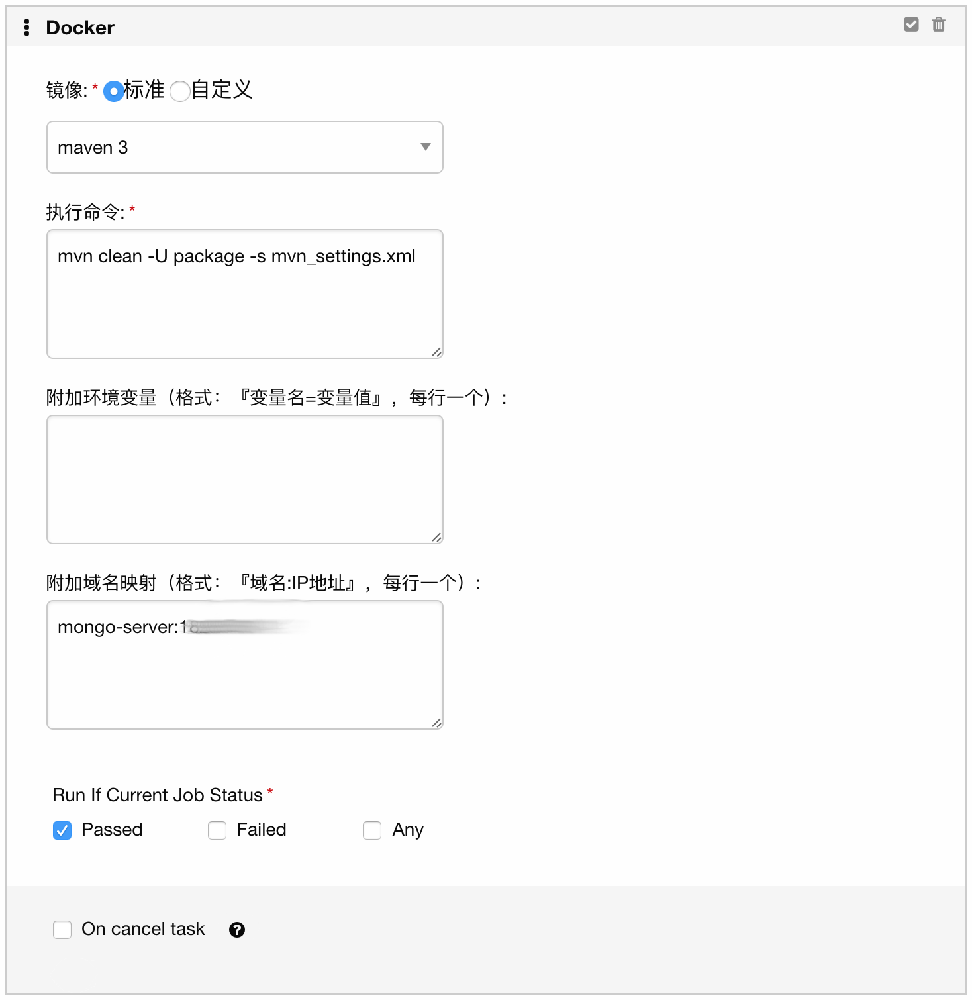

# gocd-plugin-dind
GoCD plugin for execute dind task

## How to use

```
wget https://github.com/tw-leansw/gocd-plugin-dind-task/releases/download/v0.3.1/dind-task-0.3.1.jar
```

or

```
git clone 
mvn clean package    # generate target/dind-task-0.3.1.jar file
```

Copy the dind-task-0.3.1.jar file to `plugins/external/` folder under GoCD server installation path.

Then restart GoCD Server.

## Bring your own env image

This plugin provide maven3-java8 and nodejs6 image, you could edit the `dockerImageMap` variable in `src/com/tw/go/plugin/task/GoPluginImpl.java` to add your own images.

## Snapshot


